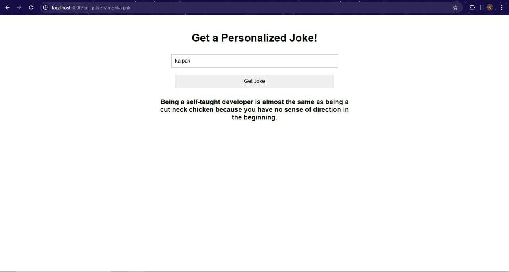

# Personalized Joke Web Application

This web application provides users with a personalized joke based on their name. The app fetches jokes from the **JokeAPI** and replaces default placeholders like "Chuck Norris", "John Doe", or "someone" with the user's name to create a more engaging and fun experience.

## Features

- **Personalized Jokes**: Replace generic placeholders in jokes with the user's name.
- **Joke Fetching**: Fetch random jokes using the **JokeAPI**.
- **EJS Templating**: Render dynamic content using **EJS** (Embedded JavaScript Templates).
- **Responsive Styling**: The app is styled with basic CSS for a better user interface.

## Project Structure
project/
    views/
        index.ejs     # EJS template for rendering jokes
    public/
        style.css     # Styles for the application
    server.js         # Main Node.js backend file
    package.json      # Project dependencies and configuration

## Installation

### 1. Clone the repository:

Clone this repository to your local machine using the following command:

```bash
git clone https://github.com/Mech-Kal/jokes-api-project
```

### 1. Install Depedencies:
To install the required dependencies, run:
```bash
npm install
```
This will install all the necessary libraries like Express, EJS, and Axios.

### 3. Start the server:
Once the dependencies are installed, start the application using:

```bash
node server.js
```
This will start the server on http://localhost:3000 by default.


### Usage
1. Open your browser and navigate to http://localhost:3000.
2. On the homepage, enter your name in the input field and click Get Joke.
3. The app will fetch a random joke from the JokeAPI, replace placeholders with your name, and display the personalized joke.
Example:

- Input: "Alice"
- Joke: "Why did Alice cross the road? To show Alice how to code!"

### Technologies Used
- Node.js: JavaScript runtime for building the backend server.
- Express: Web framework for building the app and handling HTTP requests.
- EJS: Templating engine to dynamically render content on the frontend.
- Axios: HTTP client for making API requests to JokeAPI.
- JokeAPI: A free API that provides random jokes of various categories.

### Project Image

